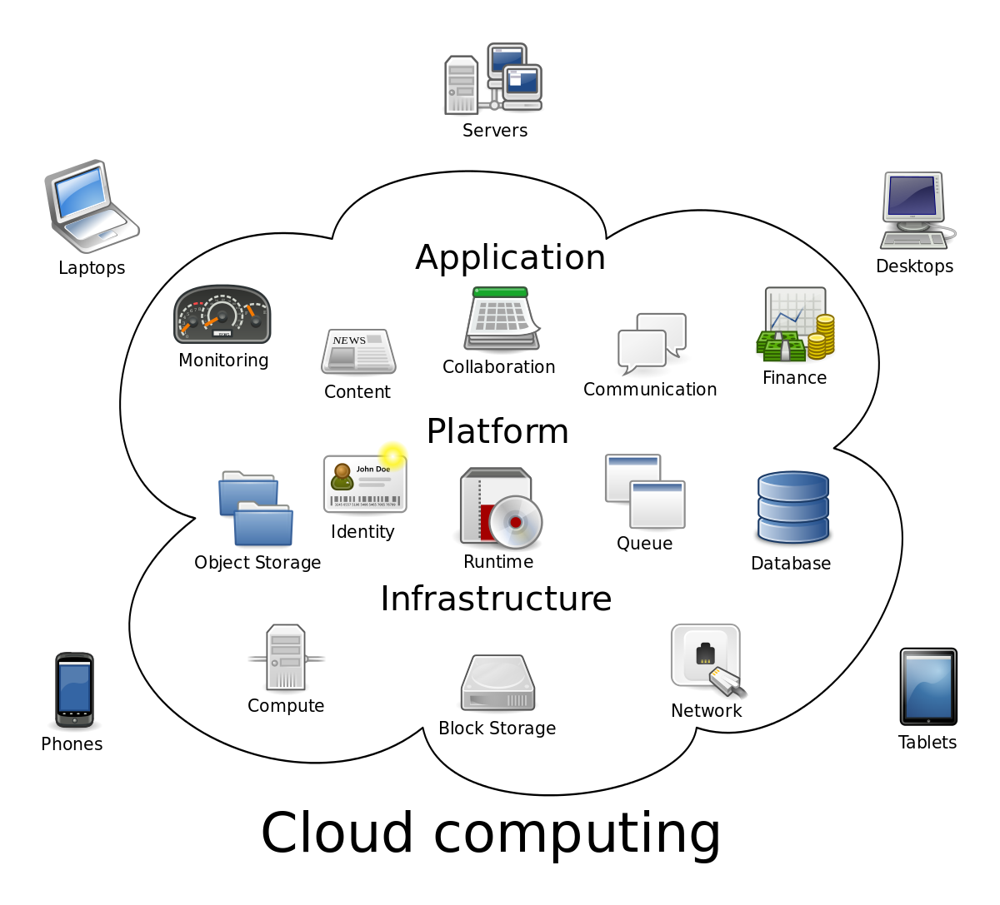

# Điện toán đám mây (Cloud Computing)

## Điện toán đám mây là gì?

Điện toán đám mây theo định nghĩa từ  **IBM** là việc cung cấp tài nguyên máy tính cho người dùng tuỳ ý theo mục đích sử dụng thông qua kết nối Internet. Nguồn tài nguyên có thể là bất cứ thứ gì liên quan đến điện toán và máy tính, ví dụ như: Phần mềm, phần cứng, hạ tầng mạng, các máy chủ, mạng lưới các máy chủ cỡ lớn.

### Lợi ích mà điện toán đám mây mang lại
- **Giảm chi phí:** Trả tiền cho những gì bạn dùng.
- **Truy cập nhanh:**
- **Dễ dàng mở rộng:**
- **Tối ưu hiệu năng:**
- **Dễ dàng vẫn chuyển thông tin:**
- **Tăng độ tin cậy:**